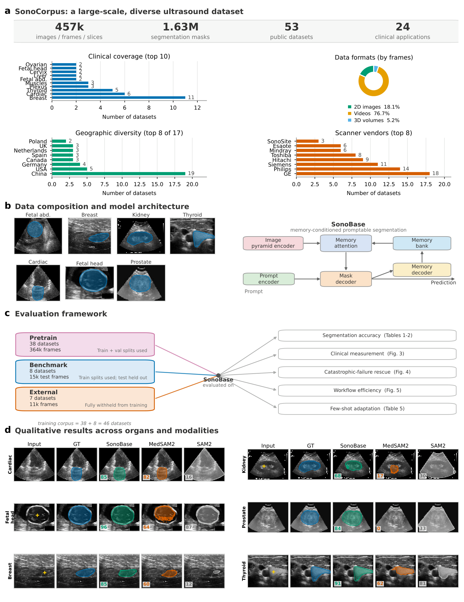

<div align="center">

# SonoBase

### Open ultrasound foundation model for robust segmentation and clinical measurement across heterogeneous settings

[](https://arxiv.org/abs/2609.19230)
[](https://huggingface.co/AlfredQin/sonobase)
[](https://doi.org/10.5281/zenodo.22770825)


[](LICENSE) [](https://huggingface.co/AlfredQin/sonobase)



</div>

**SonoBase** is an interactive segmentation foundation model for ultrasound. It adapts SAM2 with an
image-pyramid hybrid encoder and is pretrained on **SonoCorpus**, the largest open ultrasound
segmentation resource assembled to date: **53 public datasets, 456,963 images and frames,
1,626,085 expert masks, 24 clinical applications, 17 countries**. Across fifteen evaluation
datasets that introduce new organs, devices, operators and geographies, SonoBase outperforms SAM2,
SAM3, MedSAM2 and other baselines on every dataset, and clinical measurements derived from its
segmentations (ejection fraction, fetal head circumference, gestational age) fall within
inter-observer variability.

## Highlights

- **SonoCorpus**: 53 public datasets unified into one SA-1B-style format with hand-curated
  acquisition metadata (vendor, site and country, operator context, image quality) and leak-free
  splits: 38 pretraining, 8 benchmark and 7 fully held-out external datasets.
- **Image-pyramid hybrid encoder**: a Hiera-B transformer branch for global context at low
  resolution and two ConvNeXt branches for fine anatomical detail at higher resolutions, joined by
  cross-branch attention at every stage; the SAM2 prompt encoder, mask decoder and memory remain,
  so points, boxes and prompt-once video/volume propagation work out of the box.
- **Four-axis evaluation**: cross-modality generalization (2D, video, 3D), robustness to
  distribution shift (geography, device, operator, quality), clinical measurement validity, and
  breadth (failure resolution, interaction burden, dense-prediction transfer, cross-species
  transfer, subgroup fairness, few-shot adaptation).
- **Everything released**: checkpoints and optimizer states, data-split indices, deduplication
  hashes, the licence audit of every constituent dataset, and starter code for fine-tuning.

## Release artifacts

| Artifact | Where | Notes |
|---|---|---|
| Paper | https://arxiv.org/abs/2609.19230 | preprint (arXiv:2609.19230), main text and supplementary information |
| Code (this repository) | https://github.com/AlfredQin/sonobase | training, evaluation, few-shot, analysis and figure scripts |
| Pretrained weights + optimizer states | https://huggingface.co/AlfredQin/sonobase | `sonobase_hiera_b_conv_s_conv_t.pt` (706 MB) and the full distributed checkpoint (2.1 GB) |
| SonoCorpus manifest: dataset sources and licences, split lists, per-file checksums, per-unit metadata, evaluation records | https://doi.org/10.5281/zenodo.22770825 | manifest only (CC BY 4.0); no images or masks are re-hosted, datasets are obtained from their sources under their own terms; `tools/verify_manifest.py` checks a local copy against it |
| Interactive demo | coming soon (Hugging Face Space) | point / box prompts on images, prompt-once propagation on clips |
| Project website | coming soon | figures, results, dataset and licence tables |

## Installation

```bash
git clone https://github.com/AlfredQin/sonobase.git
cd sonobase/src/setup && bash setup-uv-env.sh           # creates .venv from pyproject.toml + uv.lock
# on a Slurm cluster with a container image: bash project-setup.sh cluster (see container.env)
cd .. && export PYTHONPATH=$PWD:$PYTHONPATH             # nemo_cv is imported from src/
```

Set the asset locations once (defaults are read by every script through `${VAR:?}`):

```bash
export DATASET_DIR=/path/to/SonoCorpus            # converted datasets, one folder per dataset
export ANNOTATION_DIR=/path/to/38_pt_8_bm_7_ext_v2 # split manifests from the Zenodo record
export CHECKPOINT_DIR=/path/to/checkpoints         # SAM2 base weights + SonoBase .pt
```

## Quick start

**Segment with SonoBase (image, point or box prompt)**

```python
import torch, hydra
from omegaconf import OmegaConf
from nemo_cv.components.models.sam2.sam2_image_predictor import SAM2ImagePredictor

cfg = OmegaConf.load("configs/analysis/model/sam2.yaml")          # composes the TriBranch encoder
model = hydra.utils.instantiate(cfg, _recursive_=True, _convert_="all").cuda().eval()
sd = torch.load("sonobase_hiera_b_conv_s_conv_t.pt", map_location="cpu", weights_only=True)["model"]
model.load_state_dict(sd, strict=False)
pred = SAM2ImagePredictor(model)
pred.set_image(image_rgb_uint8)                                    # H x W x 3
masks, scores, _ = pred.predict(point_coords=[[x, y]], point_labels=[1], multimask_output=False)
```

**Reproduce the paper**

| Phase | Entry point | Doc |
|---|---|---|
| Pretraining on SonoCorpus | `scripts/pretrain/pretrain_sonobase_on_sonocorpus.sh` | `scripts/pretrain/README.md` |
| Per-dataset test | `scripts/pretrain/test_*.sh` | `scripts/pretrain/README.md` |
| 15-dataset benchmark vs SAM2 / MedSAM2 | `scripts/benchmarks/test_sam2/` | `scripts/benchmarks/test_sam2/README.md` |
| Clinical validation, subgroups, few-shot | `scripts/analysis/`, `scripts/few_shot/` | `scripts/analysis/README.md`, `scripts/few_shot/README.md` |
| Detection / instance transfer | `scripts/us_rfdetr/` | `nemo_cv/recipes/us_rfdetr/` |
| Paper figures | `scripts/analysis/make_paper_figures.py` | `scripts/analysis/README.md` |

Per-sample evaluation records behind the reported numbers are part of the SonoCorpus manifest on Zenodo (`evaluation_records/`).

## SonoCorpus

| Tier | Datasets | Role |
|---|---|---|
| Pretrain | 38 | train + val splits used for pretraining |
| Benchmark | 8 | train splits used; test splits held out |
| External | 7 | fully withheld from training |

SonoCorpus itself is not redistributed. The Zenodo manifest (`sonocorpus_datasets.csv`) lists, for all
53 datasets, the source, the access conditions and licence as stated by the source, and per-file
checksums. The converters in `src/data/us_datasets/` rebuild the SonoCorpus copy from the original
downloads, and `tools/verify_manifest.py` checks the result against the manifest. How duplicates were
removed and the leak-free splits generated is described in [docs/DATA_SPLITS.md](docs/DATA_SPLITS.md).

## Citation

```bibtex
@article{sonobase2026,
  title         = {Open ultrasound foundation model for robust segmentation and clinical measurement across heterogeneous settings},
  author        = {Qin, Chao and Khan, Fahad Shahbaz and Khan, Salman and Ather, Sarim and
                   Anwar, Siddiq and Anwer, Rao Muhammad and Khan, Shadab},
  journal       = {arXiv preprint arXiv:2609.19230},
  year          = {2026},
  eprint        = {2609.19230},
  archivePrefix = {arXiv},
  primaryClass  = {cs.CV},
  doi           = {10.48550/arXiv.2609.19230}
}
```

Please also cite the original publication of every SonoCorpus dataset you use; the list is in the
Zenodo record and in Supplementary Table S1 of the paper.

## Licence and disclaimer

Code in this repository is released under the [MIT License](LICENSE). The SonoBase model weights
and optimizer states on Hugging Face are released under CC BY-NC 4.0 (non-commercial), because
several constituent datasets of SonoCorpus are non-commercial. The SonoCorpus manifest on Zenodo is
CC BY 4.0; the constituent datasets keep the licences of their sources. SonoBase is a research tool
and not a medical device.

## Acknowledgements

Built on [SAM2](https://github.com/facebookresearch/sam2), [Hiera](https://github.com/facebookresearch/hiera),
[ConvNeXt / DINOv3](https://github.com/facebookresearch/dinov3) and [NeMo AutoModel](https://github.com/NVIDIA/NeMo).
We thank the authors of the 53 public datasets that make SonoCorpus possible.
