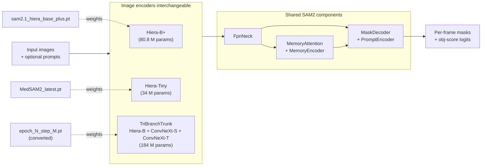

# Benchmark recipes (`src/nemo_cv/recipes/benchmarks/`)

This directory contains the **three Python modules** that drive the
SAM2 / MedSAM2 / Sonobase benchmark comparison:

```
src/nemo_cv/recipes/benchmarks/
├── test_sam2.py                  Test recipe: load a .pt, evaluate on multiple datasets
├── iterative_eval.py             B2 standalone: encoder-cached iterative-correction sweep
├── aggregate_iterations.py       B1 helper: merge N test_metrics.json files → long-format CSV
├── convert_sonobase_dcp_to_pt.py Converter: sonobase DCP checkpoint → single .pt file
├── compare_benchmarks.py         Aggregator: per-model JSON → comparison CSV
└── __init__.py
```

The `iterative_eval.py` / `aggregate_iterations.py` pair is the
infrastructure for the **iterative-correction sweep** (curves over
`num_correction_pt_per_frame_val ∈ {0, 1, 3, 5, 7}`). The default
production workflow ("B1") loops `test_sam2.py` per iteration count and
folds the resulting JSONs via `aggregate_iterations.py`. The standalone
`iterative_eval.py` ("B2") does the same sweep in a single process with
the image encoder cached across iterations — kept as a verification
tool until B1 ≈ B2 has been validated empirically. See
[`src/scripts/benchmarks/test_sam2/iterative/README.md`](../../../scripts/benchmarks/test_sam2/iterative/README.md)
for the full B1 vs B2 contrast.

Each is a `python -m`-runnable entry point with its own CLI. Read this
document when you need to understand or modify the recipe-level code.

For *how to run* the benchmark, see
[`src/scripts/benchmarks/test_sam2/README.md`](../../../scripts/benchmarks/test_sam2/README.md).
For *how the configs map to Python objects*, see
[`src/configs/test_sam2/README.md`](../../../configs/test_sam2/README.md).

---

## Architecture overview

The three benchmarked models share the SAM2 architecture and differ only in
the **image encoder** and the **pretrained weights**:



The benchmark recipe `test_sam2.py` is **architecture-agnostic** above
the encoder line: an experiment overlay swaps in whichever
`image_encoder/<variant>.yaml` matches the checkpoint, and the rest of the
model (neck, memory bank, decoder) is identical across all three. Because
the model wraps everything in a single `SAM2Train` instance, one PyTorch
state dict layout works for all three checkpoints.

---

## Recipe 1: `test_sam2.py` (`TestSam2BenchmarkRecipe`)

Single-purpose test recipe. **Loads a `.pt` checkpoint** (in SAM2's
`{"model": state_dict}` convention) and evaluates the model on one or more
held-out datasets.

### Why a `.pt`-only recipe (not DCP)?

The sonobase pretrain recipe writes DCP-sharded directories (one shard per
DDP rank), but SAM2 and MedSAM2 are released as single `.pt` files. The
benchmark recipe is intentionally simple: it accepts only `.pt`, and the
sonobase DCP checkpoint goes through `convert_sonobase_dcp_to_pt.py` first.
Trade-offs:

- **Pro**: One uniform load path. The recipe doesn't have to detect
  checkpoint format or branch on it. Comparison-aggregator code doesn't
  have to know either.
- **Pro**: Conversion is once-per-pretraining-run; subsequent test runs
  (different prompting protocols, different test sets) reuse the same
  `.pt`.
- **Con**: Adds a separate command for sonobase. The runner script
  (`test_sonobase_on_busi_camus.sh`) handles this and is idempotent — if
  the `.pt` already exists, it skips the conversion.

### Setup phase (`TestSam2BenchmarkRecipe.setup()`)

The recipe inherits from `BaseRecipe` and reuses the **stateless builders**
from `nemo_cv.recipes.sonobase.pretrain` (`build_distributed`, `build_model`,
`build_loss_fn`, `setup_ddp`) so model + DDP assembly stays in sync with
the pretrain pipeline.

| Step | What gets built | Source config | Stored as |
|---|---|---|---|
| 1 | `DistInfo` (process group, device, rank) | `cfg.dist_env` | `self.dist_env` |
| 2 | CUDA backend flags | `cfg.cuda` | side effect on `torch.backends` |
| 3 | Loss `nn.ModuleDict` (optional) | `cfg.loss_fn` (None-safe) | `self.test_loss_fn` |
| 4 | Model (`SAM2Train` with whichever `image_encoder.*` the experiment selects), with NO `pretrained_ckpt_path` | `cfg.model` | local var, then `self.model` after DDP wrap |
| 5 | DDP-wrapped model (`find_unused_parameters: false` for eval) | `cfg.distributed` | `self.model` |
| 6 | **Load `.pt` weights** with `strict=False` | `cfg.ckpt_path` | side effect on `self.model.load_state_dict` |
| 7 | Test datasets (one DataLoader per named dataset) | `cfg.data.test` (or `cfg.data.val` as fallback) | `self.test_datasets` |
| 8 | Per-dataset `torchmetrics` (mIoU, Dice) | `cfg.val_metrics` | `self.test_metrics[ds_name]` |
| 9 | `MetricLogger` for `test.jsonl` (buffer_size=1, flush=True) | `cfg.checkpoint.save_dir` | `self.metric_logger_test` (rank 0 only) |

Notes:

- **`strict=False` weight loading** is required because the SAM2 release
  `.pt` includes a `no_mem_pos_enc` parameter that our model no longer
  registers when `directly_add_no_mem_embed=true`. This shows up as 1
  unexpected key. See `src/scripts/pretrain/README.md` Lessons Learned for
  the full story.
- **No optimizer / GradScaler / GradClipper** is built — eval-only.
- **`weights_only=True`** is used for `torch.load`, so any provenance fields
  in the `.pt` must be plain `str`/`int`/`float` (see converter section below).
- `BaseRecipe.__setattr__` skips checkpoint-tracking for any attribute name
  containing `"test"`, `"val"`, `"eval"`, `"loss"` — so `self.test_datasets`,
  `self.test_metrics`, `self.test_loss_fn`, `self.metric_logger_test` etc.
  don't accidentally trigger checkpoint writes.

### Test loop (`run_test_loop()`)

```python
@torch.no_grad()
def run_test_loop(self):
    self.model.eval()
    all_results = {}

    for ds_name, dataset in self.test_datasets.items():
        loader = dataset.get_loader(epoch=0)
        ds_loss_sum_local, ds_n_samples_local = 0.0, 0

        for batch in loader:
            batch = batch.to(self.device, non_blocking=True)
            with autocast(dtype=bfloat16):
                outputs = self.model(batch)
                if self.test_loss_fn is not None:
                    loss = self.test_loss_fn[batch.dict_key](outputs, batch.masks)
                    if isinstance(loss, dict): loss = loss[CORE_LOSS_KEY]
                    ds_loss_sum_local += loss.item() * batch.num_videos

            for m in self.test_metrics[ds_name].values():
                m.update(outputs, batch)
            ds_n_samples_local += batch.num_videos

        # All-reduce loss across DDP ranks; torchmetrics auto-syncs internally
        all_results[ds_name] = {...metrics + n_samples...}

    if self.dist_env.is_main:
        self._write_results(all_results)
```

The loop is structurally identical to the validation loop in `pretrain.py`,
modulo three things:

1. No model-train state to flip — runs entirely under `torch.no_grad()` and
   `model.eval()`.
2. Per-dataset metrics are *the only* metrics — no aggregate metrics
   continuously updated across datasets (would conflate semantically
   different domains).
3. Output format is JSON + CSV + JSONL, written in `_write_results`.

### Output: `results/test_metrics.{json,csv}` + `test.jsonl`

Three files, written to `${cfg.checkpoint.save_dir}/`:

- **`results/test_metrics.json`**: full structured record, including the
  absolute checkpoint path (`"checkpoint": "${CHECKPOINT_DIR}/SAM2/..."` resolved at runtime),
  per-dataset records, and macro+micro aggregates over datasets.
- **`results/test_metrics.csv`**: flat table — one row per dataset + macro/micro
  aggregate rows. Convenient for paper tables and quick eyeballing.
- **`test.jsonl`**: JSON-lines log with one record per dataset, parity with
  `validation.jsonl` from training.

The aggregator (`compare_benchmarks.py`, below) consumes the `.json` form.

---

## Recipe 2: `convert_sonobase_dcp_to_pt.py` (the converter)

A standalone single-process script that converts a sonobase DCP checkpoint
directory into a single `.pt` file matching the SAM2 release format.

### Design rationale

DCP shards are tied to the DDP world size and rank layout used at save
time. They can be loaded with a different number of ranks, but only by
going through DCP machinery (which itself requires distributed init). The
benchmark recipe doesn't want to deal with that complexity — it should be
the same recipe code regardless of which model's checkpoint it's loading.

So we convert once, store a single `.pt`, and feed it to the recipe like
any other SAM2-format checkpoint.

### How it works

```python
def convert(dcp_dir: str, out_pt: str) -> dict:
    # 1. Read the resolved Hydra config that was snapshotted at training time
    hcfg = OmegaConf.load(os.path.join(dcp_dir, "config.yaml"))
    OmegaConf.resolve(hcfg)

    # 2. Rebuild the same model
    model = build_model(hcfg.model, device, seed=hcfg.seed, pretrained_ckpt_path=None)

    # 3. Initialize a single-process distributed group (gloo, world_size=1)
    #    so DCP collectives can no-op cleanly
    _init_single_process_group()

    # 4. Build a minimal Checkpointer and load DCP shards into the model
    checkpointer = Checkpointer(...)
    checkpointer.load_model(model, os.path.join(dcp_dir, "model"))

    # 5. Save model state_dict + provenance to a .pt file
    torch.save({"model": model.state_dict(), "_provenance": {...}}, out_pt)

    return provenance
```

Key implementation details:

- **Single-process distributed init**: PyTorch's DCP API uses
  `torch.distributed` collectives even on single rank; they no-op when
  `world_size=1`. We bring up a gloo backend on a free TCP port to satisfy
  the API surface, then tear it down at the end.
- **Reads `config.yaml` from the checkpoint dir**: the training recipe
  saves the fully-resolved Hydra config inside each `epoch_N_step_M/`. The
  converter uses that snapshot rather than asking the user to re-specify
  the model config — guaranteed to match the weights.
- **Provenance dict**: stores `source_dcp_dir`, `converted_at` timestamp,
  `host`, `git_hash`, `torch_version`, `n_params`. All values are plain
  Python primitives so `weights_only=True` loads work. (`torch.__version__`
  is a `TorchVersion` subclass of `str`, which the restricted unpickler
  rejects — we cast to `str` explicitly.)
- **Idempotency at the script level**: the runner script
  (`test_sonobase_on_busi_camus.sh`) checks for the output `.pt` and skips
  conversion if it already exists. Delete the `.pt` to force a re-conversion.

### CLI

```bash
uv run python -m nemo_cv.recipes.benchmarks.convert_sonobase_dcp_to_pt \
    <dcp_dir> <out_pt>
```

`<dcp_dir>` is the checkpoint directory (e.g. `epoch_1_step_387`). It must
contain `config.yaml` and a `model/` subdir with DCP shards. `<out_pt>` is
the destination `.pt` path; parent dirs are created if needed.

The script is **single-process** — no `torchrun` wrapper needed, runs on
CPU by default (uses GPU if available, but doesn't need to).

### When you'd want to re-run the converter

- New sonobase pretraining run produces a new DCP dir → convert it to get a
  fresh `.pt` for benchmarking.
- Architecture change in `SAM2Base` or `TriBranchTrunk` → the saved DCP
  shards may have keys that don't map cleanly to the new model. The
  converter loads through the new model, so keys absent from the new model
  are silently dropped (extra params in the .pt) but missing-on-disk keys
  will surface as a DCP error. Re-run from a fresh DCP checkpoint
  produced by the new code in that case.

---

## Recipe 3: `compare_benchmarks.py` (the aggregator)

A small standalone script that reads N `test_metrics.json` files (one per
benchmarked model) and emits a single comparison CSV.

### Why a separate aggregator?

Because the benchmark recipe runs **once per model** (different
checkpoints, different image encoders), each run writes its own
`test_metrics.{json,csv}` independently. The comparison "view" — one row
per (dataset, metric), one column per model — is a join across N files
that doesn't naturally fit inside any single recipe run. Putting it in a
post-hoc aggregator keeps the per-model runs clean and the comparison
flexible (you can compare any subset of models, in any order).

### How it works

```python
def main():
    runs = parse(--runs):  # list of (label, json_path) pairs
    rows = build_comparison_rows(runs)
    write_csv(rows, --output)
    if --print: print_table(rows)
```

The interesting bit is `build_comparison_rows`:

- **Discover metric names** by walking all runs and collecting keys
  (excluding bookkeeping fields `n_samples`, `n_iters_per_rank`,
  `elapsed_sec`). First-seen wins for ordering, so models early in the
  argument list determine column order.
- **Discover dataset names** the same way.
- **Build per-dataset rows**: one row per (dataset, metric) tuple, columns
  are model labels. Missing values render as the empty string.
- **Append aggregate rows**: `AGGREGATE_MACRO` (unweighted mean) and
  `AGGREGATE_MICRO` (sample-weighted mean) for each metric, one row each.
- **Write to CSV**, optionally pretty-print to stdout.

### CLI

```bash
uv run python -m nemo_cv.recipes.benchmarks.compare_benchmarks \
    --runs label1=path1.json label2=path2.json [...] \
    --output comparison.csv \
    [--print]
```

### Example output

```
dataset         | metric    | sam2_no_ft | medsam2 | sonobase
----------------+-----------+------------+---------+---------
BUSI            | miou      | 0.4237     | 0.7874  | 0.7961
BUSI            | dice      | 0.5236     | 0.8695  | 0.8806
BUSI            | test_loss | 1.0597     | 0.3020  | 0.2960
CAMUS           | miou      | 0.1636     | 0.8872  | 0.8044
CAMUS           | dice      | 0.2713     | 0.9387  | 0.8874
CAMUS           | test_loss | 43.2215    | 7.4529  | 6.0815
AGGREGATE_MACRO | miou      | 0.2936     | 0.8373  | 0.8002
AGGREGATE_MACRO | dice      | 0.3975     | 0.9041  | 0.8840
AGGREGATE_MACRO | test_loss | 22.1406    | 3.8775  | 3.1887
AGGREGATE_MICRO | miou      | 0.2651     | 0.8483  | 0.8011
AGGREGATE_MICRO | dice      | 0.3698     | 0.9117  | 0.8848
AGGREGATE_MICRO | test_loss | 26.7681    | 4.6623  | 3.8237
```

(These are the actual numbers from the smoke test on busi_camus. Sonobase
is comparable to MedSAM2 in the smoke test because sonobase was trained on
busi_camus data while MedSAM2 has never seen these specific datasets — but
on a small/debug-scale subset, so don't read too much into the gap.)

---

## End-to-end workflow for one new sonobase pretraining run

If you've just finished pretraining a new sonobase model and want to add
its results to the benchmark:

```bash
cd src

# 1. Convert the DCP checkpoint → .pt
uv run python -m nemo_cv.recipes.benchmarks.convert_sonobase_dcp_to_pt \
    ./experiments/sonobase/pretrain/<run>/<epoch_N_step_M> \
    ./experiments/sonobase/pretrain/<run>/<epoch_N_step_M>.pt

# 2. Run the benchmark recipe pointing at that .pt
uv run torchrun --nproc_per_node=4 -m nemo_cv.recipes.benchmarks.test_sam2 \
    -c ./configs/test_sam2 -cn test \
    experiment=test_hiera_b_conv_s_conv_t_on_busi_camus \
    ckpt_path=./experiments/sonobase/pretrain/<run>/<epoch_N_step_M>.pt \
    scratch.experiment_name=benchmarks/busi_camus/hiera_b_conv_s_conv_t/<run>_p0

# 3. (Optional) Re-run the comparison aggregator with the new sonobase result
uv run python -m nemo_cv.recipes.benchmarks.compare_benchmarks \
    --runs sam2_no_ft=./experiments/benchmarks/busi_camus/sam2/p0/results/test_metrics.json \
           medsam2=./experiments/benchmarks/busi_camus/medsam2/p0/results/test_metrics.json \
           sonobase_<run>=./experiments/benchmarks/busi_camus/hiera_b_conv_s_conv_t/<run>_p0/results/test_metrics.json \
    --output ./experiments/benchmarks/busi_camus/comparison_<run>.csv \
    --print
```

---

## See also

- [`src/scripts/benchmarks/test_sam2/README.md`](../../../scripts/benchmarks/test_sam2/README.md) —
  How to run the benchmark; CLI reference; lessons learned.
- [`src/configs/test_sam2/README.md`](../../../configs/test_sam2/README.md) —
  Hydra config tree; how YAMLs map to the objects this recipe instantiates.
- [`src/nemo_cv/recipes/sonobase/README.md`](../sonobase/README.md) —
  The pretrain recipe whose DCP checkpoints feed the converter.
- [`src/scripts/pretrain/README.md`](../../../scripts/pretrain/README.md) —
  How sonobase pretraining works.
