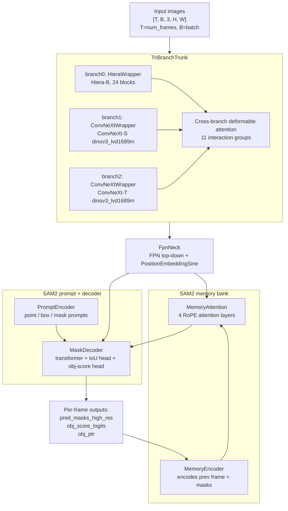

# Sonobase recipes (`src/nemo_cv/recipes/sonobase/`)

This directory contains the two **recipe modules** that orchestrate sonobase
training and evaluation: `pretrain.py` and `test.py`. Each one is a
self-contained `python -m`-runnable entry point that:

1. Reads a Hydra config tree (composed from `src/configs/pretrain/`).
2. Builds a `nn.Module` model, an optimizer, datasets, metrics, and a
   `Checkpointer` from that config.
3. Runs a training or evaluation loop using PyTorch DDP across multiple GPUs.
4. Writes outputs (JSONL logs + checkpoints) to disk under
   `./experiments/<run_name>/`.

This document explains the **architecture** of the model, the **build phase**
of the recipes, and the **training / evaluation loops** that drive them.
Read it when you need to understand or modify recipe-level behaviour.

For *how to run* the recipes, see
[`src/scripts/pretrain/README.md`](../../../scripts/pretrain/README.md).
For *how the configs map to objects*, see
[`src/configs/pretrain/README.md`](../../../configs/pretrain/README.md).

---

## Files in this directory

```
src/nemo_cv/recipes/sonobase/
├── pretrain.py     TrainSonobaseRecipe — training loop with checkpointing
├── test.py         TestSonobaseRecipe  — load a trained checkpoint, evaluate on test sets
└── __init__.py
```

Both modules expose a `main()` entry point that parses CLI arguments,
composes a Hydra config, instantiates the recipe class, calls `setup()`, and
runs the appropriate loop. They share a set of stateless **builder
functions** at module scope of `pretrain.py` (`build_distributed`,
`build_model`, `build_loss_fn`, `build_datasets`, `build_optimizer`,
`build_checkpoint_config`, `build_step_scheduler`, `setup_ddp`); `test.py`
imports these from `pretrain.py` rather than duplicating them, so any change
to model / data / loss assembly propagates to both.

---

## Architecture overview

The model is a **SAM2-based video object segmentation network** with a
custom multi-branch image encoder ("TriBranchTrunk"). Concretely:



Key points about this architecture:

- **Three parallel image encoders** (Hiera-B, ConvNeXt-S, ConvNeXt-T) with
  cross-branch deformable attention at 11 splits along the depth. Different
  receptive fields and inductive biases get fused into a single multi-scale
  feature pyramid. Hiera contributes hierarchical global structure;
  ConvNeXts contribute texture-sensitive local features pretrained on
  DINOv3 (Hugging Face's `convnext_*.dinov3_lvd1689m` weights).
- **FpnNeck** projects the top-down hierarchy of features into the SAM2
  hidden dim (256) and adds 2D sinusoidal positional encoding.
- **Memory attention + memory encoder** are SAM2's video-tracking machinery:
  they propagate object-aware features from one frame's prediction into the
  next frame's encoding via cross-attention.
- **Prompt encoder + mask decoder** consume the encoded image features (plus
  any point / box / mask prompts) and produce the final per-frame masks.

The full model is wired up by `SAM2Train` (`nemo_cv.components.models.sam2.sam2_train`),
which inherits `SAM2Base` and adds the training-time logic for prompt
sampling, correction-frame selection, and per-frame loss computation.

The model has roughly **184 M parameters** (all trainable), the bulk of
which (~140 M) are in the TriBranchTrunk.

For the tensor flow inside one training step, see "Inside `_forward_backward_step`"
below.

---

## Recipe 1: `pretrain.py` (`TrainSonobaseRecipe`)

### Setup phase (`TrainSonobaseRecipe.setup()`)

The setup builds every stateful object the training loop needs. It reads the
composed Hydra config (`self.hydra_cfg`) and uses `hydra.utils.instantiate`
recursively to materialize each component from its `_target_` entry.

| Step | What gets built | Source config | Stored as |
|---|---|---|---|
| 1 | `DistInfo` (process group, device, rank) | `cfg.dist_env` | `self.dist_env` |
| 2 | `StatefulRNG` (per-rank seed) | `cfg.seed` | `self.rng` |
| 3 | W&B run (optional) | `cfg.wandb` (only if present) | `self.wandb_run` |
| 4 | CUDA backend flags (cudnn deterministic / benchmark / TF32) | `cfg.cuda` | side effect on `torch.backends` |
| 5 | Loss `nn.ModuleDict` keyed by dataset name | `cfg.loss_fn` | `self.loss_fn` |
| 6 | `Checkpointer` (DCP-based) | `cfg.checkpoint` | `self.checkpointer` |
| 7 | Model (`SAM2Train`), optionally loading SAM2 init weights | `cfg.model`, `cfg.pretrained_ckpt_path` | local var, then `self.model` after DDP wrap |
| 8 | `SAM2Optimizer` (AdamW + per-group schedulers) | `cfg.optim` | `self.optim`, `self.optimizer` |
| 9 | `GradientClipper` | `cfg.optim.gradient_clip` | `self.gradient_clipper` |
| 10 | `torch.amp.GradScaler` | `cfg.optim.amp` | `self.scaler` |
| 11 | DDP-wrapped model | `cfg.distributed` | `self.model` |
| 12 | Train + val datasets | `cfg.data` | `self.train_dataset`, `self.val_datasets` (dict) |
| 13 | `StepScheduler` (step + epoch counters, validation/checkpoint cadence) | `cfg.step_scheduler` | `self.step_scheduler` |
| 14 | `MetricLogger` for `training.jsonl` and `validation.jsonl` | `cfg.checkpoint.save_dir` | `self.metric_logger_train`, `self.metric_logger_valid` |
| 15 | Per-dataset and aggregate `torchmetrics` | `cfg.val_metrics` | `self.val_metrics` (aggregate), `self.per_dataset_val_metrics[ds_name]` |
| 16 | Resume from `LATEST` checkpoint if any | `cfg.checkpoint.restore_from` (default `None`) | side effect: `self.model`, `self.optimizer`, `self.scaler`, `self.step_scheduler`, RNGs all loaded |

After setup, every state-tracked attribute (model, optimizer, scaler, RNG,
dataloader, scheduler) is registered with `BaseRecipe.__state_tracked` so
later `save_checkpoint(...)` / `load_checkpoint(...)` calls work
transparently.

### Why some state has odd names

`BaseRecipe.__setattr__` skips state-tracking for any attribute whose name
contains `"val"`, `"eval"`, `"test"`, or `"loss"` (see
`base_recipe.py:238`). That's why `self.val_metrics`, `self.val_datasets`,
`self.test_*`, `self.loss_fn`, `self.metric_logger_valid` etc. don't get
checkpointed — only training-state attributes do (`self.model`,
`self.optimizer`, `self.step_scheduler`, `self.rng`, ...).

If you add a new attribute that should NOT be checkpointed (e.g., a
diagnostic metric, a separate eval head), name it with one of those
substrings.

### Training loop (`run_train_validation_loop()`)

Pseudocode of the actual loop:

```python
def run_train_validation_loop(self):
    # If we resumed mid-training, optionally re-run validation for the prev epoch
    if self.step_scheduler.epoch > 0:
        if self._is_intermediate_val_epoch(self.step_scheduler.epoch - 1):
            val_log_data = self._run_validation()
            self.log_val_metrics(val_log_data)

    self.model.train()

    # Outer loop: yields 0, 1, 2, ..., num_epochs-1 (resumes from saved epoch)
    for epoch in self.step_scheduler.epochs:
        train_loader = self.train_dataset.get_loader(epoch=int(epoch))
        self.step_scheduler.dataloader = train_loader
        iters_per_epoch = len(train_loader)

        # Inner loop: StepScheduler.__iter__ yields batches and increments self.step
        for data_iter, batch in enumerate(self.step_scheduler):
            batch = batch[0]                                      # unwrap grad_acc list
            batch = batch.to(self.device, non_blocking=True)

            log_data = self._run_train_optim_step(
                batch, epoch, data_iter, iters_per_epoch,
            )
            self.log_train_metrics(log_data)                      # writes training.jsonl

            # Validation + checkpoint at val/ckpt boundaries
            if self.step_scheduler.is_val_step and self.val_datasets:
                val_log_data = self._run_validation()
                self.log_val_metrics(val_log_data)                # writes validation.jsonl
                self.model.train()

            if self.step_scheduler.is_ckpt_step:
                self.save_checkpoint(
                    epoch=epoch,
                    step=self.step_scheduler.step,
                    train_loss=epoch_loss_sum / epoch_steps,
                    val_loss={"val_loss": ..., "miou": ...},      # for LOWEST_VAL symlink
                    best_metric_key="val_loss",
                )

        del train_loader
        gc.collect()

    self.metric_logger_train.close()
    self.metric_logger_valid.close()
    self.checkpointer.close()
```

Three things worth knowing:

1. **`for epoch in self.step_scheduler.epochs:`** — the outer loop. The
   `epochs` property yields `range(self.epoch, self.num_epochs)`, capturing
   `self.epoch` at the start. So on a fresh run it yields `0, 1, 2, ...`;
   on resume it starts at the saved epoch.
2. **`for data_iter, batch in enumerate(self.step_scheduler):`** — the inner
   loop iterates the `StepScheduler` itself, NOT the train_loader directly.
   `StepScheduler.__iter__` wraps the dataloader, increments
   `self.step_scheduler.step` after each yield, and increments
   `self.step_scheduler.epoch` after the dataloader is exhausted. The
   recipe's outer-loop `epoch` variable is independent of
   `self.step_scheduler.epoch`.
3. **Validation runs *before* checkpoint**, so the val_loss / mIoU computed
   during this iteration can be passed to `save_checkpoint(...)` and used to
   update the `LOWEST_VAL` symlink atomically.

### Inside `_forward_backward_step`

Per-batch forward + loss + backward:

```python
def _forward_backward_step(self, batch: BatchedVideoDatapoint):
    # Autocast context (bf16 by default; nullcontext if AMP disabled)
    autocast_ctx = build_autocast_context(self.hydra_cfg.optim)

    with autocast_ctx:
        outputs = self.model(batch)               # List[Dict] — one dict per frame
        targets = batch.masks                     # [T, O, H, W] ground-truth masks

        # Loss is a ModuleDict keyed by batch.dict_key (currently always "all")
        key = batch.dict_key
        loss = self.loss_fn[key](outputs, targets)

        # MultiStepMultiMasksAndIous returns a dict {core_loss, loss_mask, loss_dice, ...}
        if isinstance(loss, dict):
            extra_losses = {f"{key}_{k}": v for k, v in loss.items() if k != CORE_LOSS_KEY}
            loss = loss[CORE_LOSS_KEY]            # the single scalar to backward

    if not math.isfinite(loss.item()):
        raise FloatingPointError(f"Loss is {loss.item()}, stopping training")

    self.scaler.scale(loss).backward()            # GradScaler is no-op for bf16
    return loss, extra_losses
```

The model returns a `List[Dict]` (one dict per frame), each containing keys
like `pred_masks_high_res`, `obj_score_logits`, `obj_ptr`, etc. The loss
function (`MultiStepMultiMasksAndIous`) iterates over frames internally and
combines per-frame losses with the configured weights.

### Inside `_run_train_optim_step`

```python
def _run_train_optim_step(self, batch, epoch, data_iter, iters_per_epoch):
    self.optim.zero_grad(set_to_none=True)

    loss, extra_losses = self._forward_backward_step(batch)

    # "where": fractional progress through training (0..1).
    # epoch is the OUTER LOOP variable, not self.step_scheduler.epoch.
    exact_epoch = epoch + float(data_iter) / iters_per_epoch
    where = float(exact_epoch) / self.max_epochs
    if where < 1.0:
        # Step the LR / weight_decay schedulers (cosine, layer decay, etc.)
        self.optim.step_schedulers(where, step=int(exact_epoch * iters_per_epoch))

    if self.gradient_clipper is not None:
        self.scaler.unscale_(self.optim.optimizer)
        self.gradient_clipper(model=self.model)

    self.scaler.step(self.optim.optimizer)
    self.scaler.update()

    return MetricsSample(
        step=self.step_scheduler.step,
        epoch=epoch,
        metrics={"loss": ..., "lr": ..., "mem": ..., "where": ..., "batch_time": ..., **extra_losses},
    )
```

The "where" mechanism is SAM2's idiomatic way to drive LR / weight decay
schedules: rather than ticking schedulers per-step, they're parameterized by
fractional training progress. This makes it easy to define cosine schedules
that interpolate between `start_value` and `end_value` regardless of how
many steps an epoch happens to contain.

### Validation (`_run_validation`)

```python
@torch.no_grad()
def _run_validation(self):
    self.model.eval()
    total_loss, total_samples = 0.0, 0

    # Iterate val datasets (one DataLoader per named dataset)
    for ds_name, val_dataset in self.val_datasets.items():
        val_loader = val_dataset.get_loader(epoch=val_epoch)

        for batch in val_loader:
            batch = batch.to(self.device, non_blocking=True)
            with build_autocast_context(self.hydra_cfg.optim):
                outputs = self.model(batch)
                loss = self.loss_fn[batch.dict_key](outputs, batch.masks)
                if isinstance(loss, dict):
                    loss = loss[CORE_LOSS_KEY]

            total_loss += loss.item() * batch.num_videos
            total_samples += batch.num_videos

            # Update aggregate metrics (mIoU, dice across all val datasets)
            for m in self.val_metrics.values():
                m.update(outputs, batch)

            # Update per-dataset metrics (BUSI/miou, CAMUS/miou, ...)
            for m in self.per_dataset_val_metrics[ds_name].values():
                m.update(outputs, batch)

    # All-reduce loss across DDP ranks
    if torch.distributed.is_initialized():
        all_reduce(total_loss); all_reduce(total_samples)
    val_loss = total_loss / total_samples

    # Compute metrics (torchmetrics auto-syncs across GPUs internally)
    metrics_dict = {"val_loss": val_loss, "lr": ..., "mem": ...}
    for name, m in self.val_metrics.items():            metrics_dict[name] = m.compute().item(); m.reset()
    for ds_name, ds_metrics in self.per_dataset_val_metrics.items():
        for name, m in ds_metrics.items():              metrics_dict[f"{ds_name}/{name}"] = m.compute().item(); m.reset()

    return MetricsSample(step=..., epoch=..., metrics=metrics_dict)
```

Two important properties:

- **Per-dataset metrics**: each val dataset has its own `mIoU` and `Dice`
  instances. The recipe also keeps a separate "aggregate" set that's
  updated for *every* dataset, so `cfg.val_metrics.miou` ends up being the
  mIoU averaged over all val examples (not the average of per-dataset mIoUs).
- **DDP correctness**: `total_loss` and `total_samples` are summed across
  ranks via `all_reduce`. Torchmetrics objects auto-sync across DDP when
  `compute()` is called.

### Output: `MetricsSample` and `metric_logger_*`

Every training-step and validation-step record is wrapped in
`MetricsSample(step, epoch, metrics)` and handed to a `MetricLogger`, which
serializes it to JSONL. The recipe forces `buffer_size=1` and `flush=True`
on both train and val loggers so records hit disk immediately (the default
buffer of 100 hides validation entries until training completes — see
"Lessons learned" in scripts README).

---

## Recipe 2: `test.py` (`TestSonobaseRecipe`)

The test recipe is a leaner version of the train recipe. It is **not** a
subclass of `TrainSonobaseRecipe` — it's a standalone `BaseRecipe` subclass
that imports the same builder functions (`build_distributed`, `build_model`,
`build_loss_fn`, `build_datasets`, `setup_ddp`) so model + data assembly
is shared.

What it does NOT build (compared to pretrain):

- No optimizer (`build_optimizer` is not called).
- No `GradientClipper`.
- No `GradScaler` (forward only).
- No W&B integration (skipped by default).
- No checkpoint *writer* — `Checkpointer` is built only to use its `load_model()` method.

What it adds:

- A required `restore_from` argument (a path to a checkpoint dir produced by
  the train recipe, e.g. `epoch_1_step_387/`).
- An eval-only loop that iterates each test dataset, computes per-dataset
  metrics under `torch.no_grad()`, all-reduces optional test_loss across
  ranks, and writes machine-readable + paper-friendly outputs.

### Test loop (`run_test_loop()`)

```python
@torch.no_grad()
def run_test_loop(self):
    self.model.eval()
    all_results = {}

    for ds_name, dataset in self.test_datasets.items():
        loader = dataset.get_loader(epoch=0)
        ds_loss_sum_local, ds_n_samples_local = 0.0, 0

        for batch in loader:
            batch = batch.to(self.device, non_blocking=True)
            with build_autocast_context(self.hydra_cfg.optim):
                outputs = self.model(batch)
                if self.test_loss_fn is not None:
                    loss = self.test_loss_fn[batch.dict_key](outputs, batch.masks)
                    if isinstance(loss, dict): loss = loss[CORE_LOSS_KEY]
                    ds_loss_sum_local += loss.item() * len(batch.img_batch)

            for m in self.test_metrics[ds_name].values():
                m.update(outputs, batch)
            ds_n_samples_local += len(batch.img_batch)

        # All-reduce loss, compute torchmetrics-synced metrics, store in all_results[ds_name]
        ...

    if self.dist_env.is_main:
        self._write_results(all_results)   # JSON + CSV + console table
```

### Output: `results/test_metrics.{json,csv}` + `test.jsonl`

The test recipe writes three artifact files into
`./experiments/<scratch.experiment_name>/`:

- **`results/test_metrics.json`** — full structured record:
  ```json
  {
    "checkpoint": "/abs/path/to/epoch_1_step_387",
    "n_datasets": 2,
    "datasets": {
      "BUSI":  {"n_samples": 8, "miou": 0.755, "dice": 0.852, "test_loss": 0.391},
      "CAMUS": {"n_samples": 1942, "miou": 0.858, "dice": 0.920, "test_loss": 4.530}
    },
    "aggregate_macro": {"miou": 0.807, "dice": 0.886, "test_loss": 2.461},
    "aggregate_micro": {"miou": 0.858, "dice": 0.920, "test_loss": 4.514}
  }
  ```
- **`results/test_metrics.csv`** — flat table for paper tables:
  ```
  dataset,n_samples,miou,dice,test_loss
  BUSI,8,0.7551,0.8515,0.3908
  CAMUS,1942,0.8584,0.9200,4.5305
  
  AGGREGATE_MACRO,1950,0.8068,0.8858,2.4607
  AGGREGATE_MICRO,1950,0.8579,0.9198,4.5135
  ```
- **`test.jsonl`** — one line per dataset, parity with `validation.jsonl`.

`aggregate_macro` is the unweighted mean across datasets;
`aggregate_micro` weights by `n_samples`. Use macro when each dataset
counts equally (typical for cross-domain benchmarks); use micro when each
sample counts equally.

### Why we bypass `BaseRecipe.load_checkpoint()` for test

`BaseRecipe.load_checkpoint(restore_from)` always tries to load both model
AND optimizer state. The test recipe has no optimizer to load into, so
calling that method would error. Instead, the test recipe calls
`self.checkpointer.load_model(self.model, os.path.join(ckpt_dir, "model"))`
directly. This:

- Loads model weights from the DCP shards (`model/__N_0.distcp`).
- Tolerates extra keys in the checkpoint that aren't in the live model (DCP
  only iterates live-state keys).
- Does NOT touch optimizer / scheduler / RNG / dataloader state.

This pattern also makes the test recipe robust to model-architecture
changes that wouldn't survive a strict optimizer-state load.

---

## Component map

The two recipes thread together components from across `src/nemo_cv/components/`:

| Component | What it does | Source |
|---|---|---|
| `TriBranchTrunk` | Three-branch image encoder with cross-branch deformable attention | `models/sonobase/image_encoder/image_pyramid_hybrid_encoder.py` |
| `HieraWrapper` | Wraps Meta's Hiera with our forward signature | `models/sonobase/image_encoder/hiera.py` |
| `ConvNeXtWrapper` | Wraps timm's ConvNeXt with our forward signature | `models/sonobase/image_encoder/convnext.py` |
| `MSDeformAttn` | Cross-branch deformable attention used in the trunk | `models/sonobase/image_encoder/ms_deform_attn/` |
| `SAM2Train` | The full SAM2 training-time model (extends `SAM2Base`) | `models/sam2/sam2_train.py` |
| `SAM2Base` | SAM2 base class — memory bank, prompt routing, frame iteration | `models/sam2/modeling/sam2_base.py` |
| `MemoryAttention` / `MemoryEncoder` | Frame-to-frame memory propagation | `models/sam2/modeling/memory_attention.py` / `memory_encoder.py` |
| `MaskDecoder` / `PromptEncoder` | SAM2's mask head + prompt embeddings | `models/sam2/modeling/sam/mask_decoder.py` / `prompt_encoder.py` |
| `FpnNeck` | FPN top-down + 2D positional encoding | `models/sam2/modeling/backbones/image_encoder.py` |
| `MultiStepMultiMasksAndIous` | The combined mask + dice + IoU + class loss | `loss/sam2.py` |
| `Sam2VOSMeanIoU` / `Sam2VOSDiceScore` | torchmetrics subclasses adapted to SAM2's frame-list outputs | `metrics/segmentation.py` |
| `SAM2Optimizer` / `construct_optimizer` | AdamW + per-param-group cosine LR + layer decay | `optim/optimizer.py` |
| `GradientClipper` | Per-step gradient clipping | `optim/optimizer.py` |
| `VOSDataset` | Per-video / per-image dataset with frame sampling and transforms | `datasets/sam2/vos_dataset.py` |
| `SaUSRawDataset` / `JSONRawDataset` | Image / video raw loaders (read from disk) | `datasets/sam2/vos_raw_dataset.py` |
| `RandomUniformSampler` / `EvalSampler` | Frame samplers (random clip / all frames) | `datasets/sam2/vos_sampler.py` |
| `RepeatFactorWrapper` / `ConcatDataset` | Per-epoch repeat factor sampling + dataset concatenation | `datasets/sam2/utils.py` |
| `TorchTrainMixedDataset` | Builds a `MixedDataLoader` over multiple datasets with mixing probabilities | `datasets/sam2/sam2_datasets.py` |
| `BatchedVideoDatapoint` / `collate_fn` | Batch dataclass and per-batch collate | `datasets/sam2/data_utils.py` |
| `Checkpointer` (DCP) | Distributed checkpoint save/load | `nemo_automodel.components.checkpoint.checkpointing` (external) |
| `BaseRecipe` | Provides `__state_tracked`, `save_checkpoint`, `load_checkpoint` | `nemo_automodel.recipes.base_recipe` (external) |
| `StepScheduler` | Step + epoch counters, val/ckpt cadence | `nemo_automodel.components.training.step_scheduler` (external) |
| `MetricLogger` | JSONL writer | `nemo_automodel.components.loggers.metric_logger` (external) |
| `MetricsSample` | Dataclass for a single log record | (same) |

The "external" entries come from `nemo-automodel`, an NVIDIA library
included as a `[tool.uv.sources]` git dependency in `pyproject.toml`. The
sonobase recipes inherit from `BaseRecipe` to get the standard
checkpoint format, but otherwise extend it with project-specific logic.

---

## Checkpoint format

Each `epoch_N_step_M/` written by `save_checkpoint` is a self-contained
snapshot:

```
epoch_N_step_M/
├── config.yaml             FULLY-RESOLVED Hydra config snapshot (all interpolations resolved)
├── losses.json             {"train_loss": ..., "val_loss": ..., "miou": ...}
├── model/                  DCP-sharded model weights
│   ├── .metadata           DCP metadata (key list, shapes, dtypes, sharding)
│   ├── __0_0.distcp        Rank-0 shard
│   ├── __1_0.distcp        Rank-1 shard
│   ├── __2_0.distcp        Rank-2 shard
│   └── __3_0.distcp        Rank-3 shard
├── optim/                  DCP-sharded optimizer state (same layout)
│   ├── .metadata
│   └── __N_0.distcp
├── rng/                    Per-DP-rank torch+cuda+numpy RNG state
│   └── ...
├── scaler.pt               GradScaler state (small torch.save blob)
└── step_scheduler.pt       StepScheduler.state_dict() — {"step": X+1, "epoch": Y}
```

Symlinks at the experiment root:

- `LATEST` → most recent checkpoint dir
- `LOWEST_VAL` → checkpoint with the lowest `val_loss` (or whatever
  `best_metric_key` was passed; see `BaseRecipe.save_checkpoint`)

DCP (PyTorch's `torch.distributed.checkpoint`) shards model and optimizer
state across DDP ranks. On resume with a different number of ranks, DCP
re-shards automatically, so a 4-rank checkpoint can be loaded on 8 ranks
or 1 rank without manual conversion.

### Resume mechanism

`BaseRecipe.load_checkpoint(restore_from)` is called at the end of
`setup()`. The argument is read from `cfg.checkpoint.restore_from` (default
`None`). Behavior:

| `restore_from` value | Effect |
|---|---|
| `None` (default) | Auto-detect the latest checkpoint in `cfg.checkpoint.save_dir`. If none, start fresh. |
| `"LATEST"` | Same as above (explicit). |
| `"epoch_3_step_581"` | Resume from that specific subdir name (relative to `save_dir`). |
| `"./path/to/checkpoint"` | Resume from absolute or relative path. |

What gets loaded (in order, all driven by `__state_tracked`):

1. Loops over `__state_tracked` attributes, calls `load_state_dict` on each
   (RNG, dataloader, scheduler.pt, scaler.pt).
2. `self.checkpointer.load_model(self.model, ckpt_dir/model)` — DCP load
   into the model's existing tensors.
3. `self.checkpointer.load_optimizer(self.optimizer, self.model,
   ckpt_dir, self.scheduler)` — DCP load of optimizer + LR scheduler.

The recipe then continues training from `self.step_scheduler.epoch` (the
loaded epoch counter), running one validation if the previous epoch was an
intermediate val epoch.

---

## Lessons learned (link)

The recipes have a few subtle behaviours that bit us during development.
Full writeup is in
[`src/scripts/pretrain/README.md`](../../../scripts/pretrain/README.md#lessons-learned),
but the recipe-relevant ones are:

1. **`MetricLogger.buffer_size = 1`** is set explicitly in `setup()`. Without
   it, the default 100-record buffer hides validation entries (which only
   come 1/epoch) until training completes.
2. **`no_mem_pos_enc` was a "dead" parameter** when `directly_add_no_mem_embed=true`.
   Fixed in `SAM2Base.__init__` by mirroring the conditional-register
   pattern of `no_obj_ptr` and `no_obj_embed_spatial`. If you ever
   resurrect the `directly_add_no_mem_embed=false` branch, the parameter
   will be re-registered automatically.
3. **`is_ckpt_step` misfires when per-epoch dataloader length varies**
   (which happens when `multiplier < 1` due to stochastic rounding in
   `RepeatFactorWrapper`). The `epoch_len` baked into `StepScheduler` is
   computed from the epoch-0 dataloader and frozen. Workaround: trigger
   end-of-epoch checkpoints from the recipe's outer-loop boundary
   (`data_iter == iters_per_epoch - 1`) instead of `is_ckpt_step`. **This
   fix is not yet applied** — flagged for a future PR.
4. **W&B is opt-in** — the recipe only initializes wandb if the config has a
   `wandb:` block. Currently the train.yaml has it commented out. To enable,
   uncomment and add `name`/`project`/`entity`.
5. **`find_unused_parameters: true`** is required for DDP because some
   SAM2 parameters are conditionally routed and may have None grads on a
   given step. Removing it would require restructuring `SAM2Base.forward`.

---

## See also

- [`src/scripts/pretrain/README.md`](../../../scripts/pretrain/README.md) —
  How to run; CLI overrides; output interpretation.
- [`src/configs/pretrain/README.md`](../../../configs/pretrain/README.md) —
  Hydra config tree; how YAML composition resolves into the objects this
  recipe instantiates.
- [`pretrain.py`](pretrain.py) and [`test.py`](test.py) — the actual code.
  Both are written in a "module-level builders + a thin recipe class" style
  — start with `main()` at the bottom and follow the call chain into
  `setup()` and the loop method.
